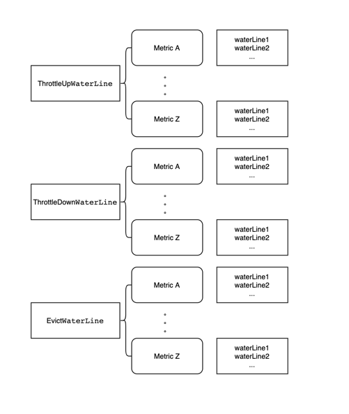
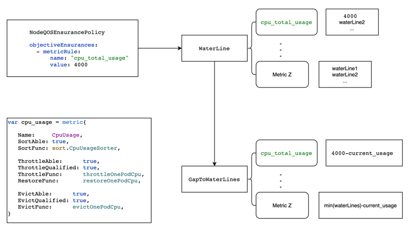

# Pod Sorting And Precise Execution For Crane Agent
该proposal丰富了crane-agent的排序策略，完善了通用排序。并且实现了一套精准操作(压制/驱逐)的框架，在执行压制/驱逐等操作时，操作到用户指定的水位线即停止的精确操作逻辑，避免了对于低优pod的过度操作；

## Table of Contents

<!-- TOC -->

- [Pod Sorting And Precise Execution For Crane Agent](#Pod Sorting And Precise Execution For Crane Agent)
    - [Table of Contents](#table-of-contents)
    - [Motivation](#motivation)
        - [Goals](#goals)
    - [Proposal](#proposal)
      - [metric概念](#metric概念)
      - [丰富pod的排序策略](#丰富pod的排序策略)
      - [构造水位线相关](#构造水位线相关)
      - [以水位线为基准进行pod的精确操作](#以水位线为基准进行pod的精确操作)
        - [analyzer阶段](#analyzer阶段)
        - [executor阶段](#executor阶段)
      - [Non-Goals/Future Work](#non-goalsfuture-work)
      - [User Stories](#user-stories)

<!-- /TOC -->
## Motivation
当前在crane-agent中，当超过NodeQOSEnsurancePolicy中指定的水位线后，执行evict，throttle等操作时先对低优先级的pod进行排序，当前排序的依据是pod的ProrityClass，然后在排序的pod进行throttle或者evict操作；

目前存在的问题有：

1. 排序只参考ProrityClass，无法满足基于其他特性的排序；同时也无法满足按照水位线精确操作对灵活排序的需求，无法满足尽快让节点达到指定的水位线的要求。例如我们希望尽快降低低优先级业务的cpu使用量时，应该选出cpu使用量较多的pod，这样能够更快地降低cpu用量，保障高优业务不受影响。

2. 在触发NodeQOSEnsurancePolicy中指定的水位线后，会对于节点上的所有低于指定ProrityClass的pod进行操作；例如，当前节点上有10个pod低于指定ProrityClass，在触发水位线后，会对这10个pod都进行操作，但是实际上可能在操作完成对第一个pod的操作后就可以低于NodeQOSEnsurancePolicy中的指标值了，对剩下的pod的操作，属于过度操作，是可以避免的。如果能以NodeQOSEnsurancePolicy中的指标值作为水位线对pod进行精确的操作，操作到刚好低于水位线是更为合适的，就能避免对低优先级服务的过度影响。

### Goals

- 实现除了ProrityClass以外的其他指标的排序方法，比如以pod cpu用量为主要参照的排序，以pod内存用量为主要参照的排序，基于当前agent主要聚焦cpu维度的情况，优先完善cpu用量的排序，同时为之后其他指标的排序提供一定的通用方法和框架
- 实现针对cpu用量的服务保障时的精确操作（压制和驱逐），在对低优pod进行操作时以NodeQOSEnsurancePolicy中的指标值为水位线，对低优pod按照包括cpu用量在内的一些列指标进行排序后进行具体操作，当节点的cpu用量低于水位线值时即停止，避免过度操作
- 为了兼容未来的可扩展性，在执行阶段，实现一套包含排序和精确操作的框架，对于未来的多种指标，只需实现一定的方法而无需关心具体的执行流程，即可实现服务保障的精确操作和定制化pod排序

## Proposal

### metric概念
首先引入metric的概念，这里的metric是用户希望在NodeQOSEnsurancePolicy中objectiveEnsurances使用的metricRule
一个metric包含如下几个维度的属性：
1. Name 表明了metric的名称，需要同collector模块中收集到的指标名称一致
2. SortAble 表明该指标是否可以排序
3. 如果可以排序，需要实现对应的排序方法SortFunc，排序方法可以排列组合一些通用方法，再结合指标自身的排序，将在下文详细介绍
4. ThrottleAble表明针对该指标，是否可以对pod进行压制，例如针对cpu使用量这个metric，就有相对应的压制手段，但是对于memory使用量这种指标，就只能进行pod的驱逐，无法进行有效的压制
5. ThrottleQualified 表明压制（restore）一个pod后，能否准确计算出经过压制后释放出的对应metric的资源量，我们将可以准确量化的指标称为可Qualified，否则为不可Qualified；
比如cpu用量，可以通过限制cgroup用量进行压制，同时可以通过当前运行值和压制后的值计算压制后释放的cpu使用量；而比如memory usage就不属于压制可量化metric，因为memory没有对应的throttle实现，也就无法准确衡量压制一个pod后释放出来的memory资源具体用量；
6. 如果ThrottleAble，需要实现ThrottleFunc，如果不可ThrottleQualified，返回的released为空
7. 如果ThrottleAble，需要实现RestoreFunc，如果不可ThrottleQualified，返回的released为空
8. 针对evict，同throttle类似，也是分为是否可以驱逐，驱逐是否Qualified，也就是驱逐一个pod，能否准确量化其释放的对应metric的资源量，cpu usage和memory usage都属于驱逐可量化metric，驱逐后的释放量就是pod运行时所占用的用量；还有对应的EvictFunc

区分Qualified的原因是精确操作的需要，对于不可量化的指标，我们无法评估压制或者驱逐一个pod到底会释放多少资源，也就无法精确计算离该指标对应的水位线的差距，无法实施精确操作。

```go
type metric struct {
	Name WaterLineMetric

	SortAble bool
	SortFunc func(pods []podinfo.PodContext)

	ThrottleAble      bool
	ThrottleQualified bool
	ThrottleFunc      func(ctx *ExecuteContext, index int, ThrottleDownPods ThrottlePods, totalReleasedResource *ReleaseResource) (errPodKeys []string, released ReleaseResource)
	RestoreFunc       func(ctx *ExecuteContext, index int, ThrottleUpPods ThrottlePods, totalReleasedResource *ReleaseResource) (errPodKeys []string, released ReleaseResource)

	EvictAble      bool
	EvictQualified bool
	EvictFunc      func(wg *sync.WaitGroup, ctx *ExecuteContext, index int, totalReleasedResource *ReleaseResource, EvictPods EvictPods) (errPodKeys []string, released ReleaseResource)
}
```
在实现一个metric的相关方法后，需要调用registerMetricMap()进行注册

当前完善丰富了CpuUsage的metric，在collector中对应了cpu_total_usage这个指标，表明了节点的cpu使用量，具体实现可以参考`crane/pkg/ensurance/executor/cpu_usage.go`

### 丰富pod的排序策略
当前对pod的排序仅支持ProrityClass，对于自定义的排序需求以及精确操作中需要的灵活排序需求是无法满足的 

- 该proposal实现了一些通用的排序方法（之后会更多地完善）：
classAndPriority： 比较两个pod的QOSClass和class value，优先比较QOSClass，再比较class value；priority高的排在后面优先级更高
runningTime：比较两个pod的运行市场，运行时间长的排在后面优先级更高

如果仅需使用这两个排序策略，使用默认的排序方法即可：会首先比较pod的优先级，之后比较pod对应指标的用量，之后比较pod的运行时长，有一个维度可以比较出结果即为pod的排序结果
```go
func GeneralSorter(pods []podinfo.PodContext) {
	orderedBy(classAndPriority, runningTime).Sort(pods)
}
```

- 同时实现了cpu用量的定制排序方法：
会依次比较两个pod的优先级，如果优先级相同的情况下，再比较cpu用量，如果cpu用量也相同的情况下继续比较ext cpu资源用量（这个是cpu属性较为特殊的一点）, 最后比较pod的运行时长，当某一个指标存在差异时即可返回比较结果
```go
func CpuUsageSorter(pods []podinfo.PodContext) {
	orderedBy(classAndPriority, cpuUsage, extCpuUsage, runningTime).Sort(pods)
}
```

- 针对需要自定义的指标，可以通过实现如下的方法，并且随意搭配通用的排序方法即可方便地实现pod的灵活自定义排序，以<metric>代表自定义metric指标，<metric-sort-func>代表自定义的针对<metric>的排序策略
```go
func <metric>Sorter(pods []podinfo.PodContext) {
	orderedBy(classAndPriority, <metric-sort-func>, runningTime).Sort(pods)
}
```
其中<metric-sort-func>只需要实现如下的排序方法即可
```go
func (p1, p2 podinfo.PodContext) int32 
```

### 构造水位线相关
1.通过多个NodeQOSEnsurancePolicy及其中的objectiveEnsurances构建多条水位线；
对objectiveEnsurances中同一操作种类中的水位线按照其metric rule（图中以metric A，metric Z作为示意）进行分类缓存，每个objectiveEnsurances水位线的值记为waterLine1，waterLine2等；

首先按照objectiveEnsurances对应的action进行分类，目前crane-agent有3个针对节点Qos进行保障的操作，分别是Evict，ThtottleDown（当前用量高于objectiveEnsurances中的值时对pod进行用量压制）和ThrottleUp（当前用量低于objectiveEnsurances中的值时对pod的用量进行放宽恢复），因此会有三个水位线集合，分别是
ThrottleDownWaterLine，ThrottleUpWaterLine和EvictWaterLine

他们的结构是这样的：
`type WaterLines map[WaterLineMetric]*WaterLine`

其中WaterLineMetric就是上面的metric的Name字段，value的WaterLine就是资源数值
`type WaterLine []resource.Quantit`

最终形成一个类似下图的数据存储：


2.依据上面的图示，结合当前节点的指标用量与WaterLines中该指标对应的水位线中最小值的差值构造如下的数据结构
`type GapToWaterLines map[WaterLineMetric]float64`

其中key值为metric的Name字段，value为用量到水位线的差值； 需要注意对于ThrottleUp，需要用水位线最小值-当前用量作为gap值，对于其他两者，使用当前用量-水位线最小值作为gap值，即始终保持gap值为正

下面三个数据分别代表了需要执行evict，ThtottleDown和ThrottleUp操作的指标及其对应的到最低水位线的差值
```go
EvictGapToWaterLines[metrics]     
ThrottoleDownGapToWaterLines[metrics]
ThrottleUpGapWaterLine[metrics]
```

以CpuUsage这个metric为例，构造节点cpu用量相关的waterline的流程和相关数据结构如下：


### 以水位线为基准进行pod的精确操作
该proposal对原先的analyzer进行了一定的修改，对executor的核心处理部分逻辑进行了较大的修改，大体流程是：

在analyzer阶段构造针对不同操作（驱逐，压制等）和不同metric的水位线，将原先的排序逻辑删除，后移到需要进行正式操作的executor阶段；

在executor阶段，根据水位线中的涉及指标的特点进行相应的排序，获取最新用量，构造GapToWaterLines，并进行精确操作

#### analyzer阶段
在该阶段进行NodeQOSEnsurancePolicy到WaterLines的转换，并对相同actionName和metricrule的规则进行合并，具体内容上文已经介绍过了

为了便于下文叙述，我们记 驱逐可量化metric 为evictMetricList，记压制可量化metric 为throttleMetricList。
这两种list中的metric都是有顺序的，按照不可压缩资源->可压缩资源排序，这也表明了执行具体操作时的顺序，比如为evictMetricList中memory会优先于cpu，因为memory属于不可压缩资源，执行驱逐时会首先满足memory的水位线要求，尽量保证节点的QoS不受影响。

#### executor阶段
这里首先介绍压制

1. 首先分析ThrottoleDownGapToWaterLines中涉及的metrics，将这些metrics区分为可Qualified和不可Qualified的
2. 如果存在不可Qualified的metric，则选择其中一个throttleAble的metric对所有的pod进行压制操作，因为但凡存在一个不可Qualified的metric，就无法进行精确的计算
3. 通过getStateFunc()获取当前节点和workload的最新用量
4. 依据上面的ThrottoleDownGapToWaterLines和实时用量构造GapToWaterLine，需要注意的是，在构造GapToWaterLine时，会以注册过的metric进行遍历，所以最终构造出来的GapToWaterLine，也会是ThrottoleDownGapToWaterLines
中注册过的metric，避免了在NodeQOSEnsurancePolicy中配置错误不存在或未注册metric的情况。
5. 遍历ThrottoleDownGapToWaterLines中qualified的metric 
6. 如果metric具有排序方法则直接使用其SortFunc进行排序，如果没有就使用GeneralSorter 
7. 使用其ThrottleFunc对pod进行压制，并计算释放出来的对应metric的资源量，直到ThrottoleDownGapToWaterLines中对应metric的gap已不存在
```go
metricsQualified, MetricsNotQualified := ThrottleDownWaterLine.DivideMetricsByQualified()

// There is a metric that can't be Qualified, then throttle all selected pods
if len(MetricsNotThrottleQualified) != 0 {
    throttleAbleMetrics := GetMetricsThrottleAble()
    if len(throttleAbleMetrics) != 0{
        errPodKeys = t.throttlePods(ctx, &totalReleased, throttleAbleMetrics[0])
    }
} else {
    ThrottoleDownGapToWaterLines, _, _ = buildGapToWaterLine(ctx.getStateFunc())
    // The metrics in ThrottoleDownGapToWaterLines are all in WaterLineMetricsCanBeQualified and has current usage, then throttle precisely
    var released ReleaseResource
    for _, m := range metricsQualified {
        if m.SortAble {
            m.SortFunc(ThrottleDownPods)
        } else {
            GeneralSorter(ThrottleDownPods)
        }

        for !ThrottoleDownGapToWaterLines.TargetGapsRemoved(m) {
            for index, _ := range ThrottleDownPods {
                errKeys, released = m.ThrottleFunc(ctx, index, ThrottleDownPods, &totalReleased)
                errPodKeys = append(errPodKeys, errKeys...)
                ThrottoleDownGapToWaterLines[m] -= released[m]
            }
        }
    }
}
```

其次介绍驱逐

驱逐和压制的流程是一样的，除了在对pod进行操作的时候需要额外判断一下pod是否已经被驱逐了，取出一个没有执行过的pod，执行驱逐操作，并计算释放出的各metric资源量，同时在对应水位线中减去释放的值，直到满足当前metric水位线要求
```go
metricsEvictQualified, MetricsNotEvcitQualified := EvictWaterLine.DivideMetricsByEvictQualified()

if len(MetricsNotEvcitQualified) != 0 {
    evictAbleMetrics := e.EvictWaterLine.GetMetricsEvictAble()
    if len(evictAbleMetrics) != 0{
        errPodKeys = e.evictPods(ctx, &totalReleased, evictAbleMetrics[0])
    }
} else {
    _, _, ctx.EvictGapToWaterLines = buildGapToWaterLine(ctx.getStateFunc(), ThrottleExecutor{}, *e)
    // The metrics in ThrottoleDownGapToWaterLines are all in WaterLineMetricsCanBeQualified and has current usage, then throttle precisely
    wg := sync.WaitGroup{}
    var released ReleaseResource
    for _, m := range metricsEvictQualified {
        if MetricMap[m].SortAble {
            MetricMap[m].SortFunc(e.EvictPods)
        } else {
            execsort.GeneralSorter(e.EvictPods)
        }

        for !EvictGapToWaterLines.TargetGapsRemoved(m) {
            if podinfo.HasNoExecutedPod(e.EvictPods) {
                index := podinfo.GetFirstNoExecutedPod(e.EvictPods)
                errKeys, released = MetricMap[m].EvictFunc(&wg, ctx, index, &totalReleased, e.EvictPods)
                errPodKeys = append(errPodKeys, errKeys...)

                e.EvictPods[index].HasBeenActioned = true
                ctx.EvictGapToWaterLines[m] -= released[m]
            }
        }
    }
    wg.Wait()
}
```

### Non-Goals/Future Work

- 在executor中针对一个metric对pod进行操作时，关于释放量，我们只考虑当前执行的metric，暂时不会考虑其余metric的受影响量，比如压制cpu时，memory的用量虽然也会收到影响，但是无法预估，同时如果指标非常多，之间的关系也是非常
复杂的，会难以维护，所以目前做简单处理
- 当前只支持CPU用量的精确操作，但是框架可以复用，未来会新增更多维度指标

### User Stories

- 用户可以更为精确地使用agent进行QoS保障，避免影响过多的低优先级的pod，提升业务的稳定性
