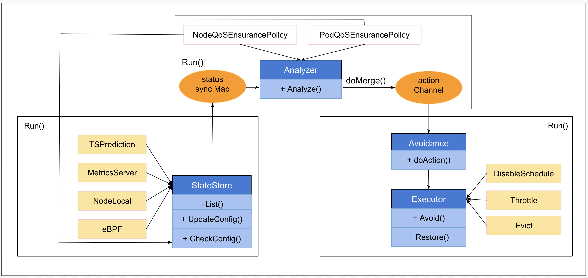

# QosEnsurance
QoS Ensurance guarantees the stability of the pods running on Kubernetes.
Disable schedule, throttle, evict will be applied to low priority pods when detect the high priority pods be impacted by resource competition.

# Features

We can define an AvoidanceAction and NodeQOSEnsurancePolicy when the node CPU usage triggers the threshold, executes
disable schedule action for the node.

The sample YAML looks like below:

```yaml
apiVersion: ensurance.crane.io/v1alpha1
kind: AvoidanceAction
metadata:
  labels:
    app: system
  name: disablescheduled
spec:
  description: disable scheduled
  coolDownSeconds: 300  # The minimum wait time the node from disable scheduling status to normal status
```

```yaml
apiVersion: ensurance.crane.io/v1alpha1
kind: NodeQOSEnsurancePolicy
metadata:
  name: "waterline1"
  labels:
    app: "system"
spec:
  nodeQualityProbe: 
    initialDelaySeconds: 10
    timeoutSeconds: 10
    nodeLocalGet:
      localCacheTTLSeconds: 60
  objectiveEnsurances:
  - name: "cpu_usage"
    avoidanceThreshold: 2     # Consider the rule is triggered, when the threshold reached continued so many times
    restoreThreshold: 2    # Restored the status, when the threshold not reached continued so many times
    strategy: "None"  # Strategy for the action, you can set it "Preview" to not  perform actually
    actionName: "disablescheduled" # The name of AvoidanceAction which be associated
    metricRule:
      name: "cpu_total_usage" # The name of metrics
      value: 4000   # The threshold of metrics
```

# Support Metrics

Name     | Description 
---------|-------------
cpu_total_usage | node cpu usage 
cpu_total_utilization | node cpu utilization 
container_sched_run_queue_time | container total threads cost time waiting in the run queue 


# Qos Ensurance Process
Qos Insurance is processed as the following steps:
1. The State store module lists the QoS insurance policies and checks the config whether it is changed. If the config is changed, the state store module will update the collectors.
2. State store collects metrics periodically.
3. Analyzer module gets metrics from the state store.
4. The analyzer module analyzes all rules to judge the avoidance threshold or the restored threshold reached.
5. Do merge for the analyzed results and notice the avoidance module to do actions.
6. Avoidance module executes actions based on the analyzed results.

Below is the process flow.
<div align="center"></div>

# Other user cases
We can define an AvoidanceAction and NodeQOSEnsurancePolicy when the node CPU usage triggers the threshold, executes
throttle action for the node.

The sample YAML looks like below:

```yaml
apiVersion: ensurance.crane.io/v1alpha1
kind: AvoidanceAction
metadata:
  name: throttle
  labels:
    app: system
spec:
  coolDownSeconds: 300
  throttle:
    cpuThrottle:
      # The minimal ratio of the CPU quota, if the pod is throttled lower than this ratio, it will be set to this ratio.
      minCPURatio: 10
      # The step for throttle action. It will reduce this percentage of CPU quota in each avoidance trigger.
      # It will increase this percentage of CPU quota in each restore trigger.
      stepCPURatio: 10  
  description: "throttle the pod"
```

```yaml
apiVersion: ensurance.crane.io/v1alpha1
kind: NodeQOSEnsurancePolicy
metadata:
  name: "waterline2"
  labels:
    app: "system"
spec:
  nodeQualityProbe:
    initialDelaySeconds: 10
    timeoutSeconds: 10
    nodeLocalGet:
      localCacheTTLSeconds: 60
  objectiveEnsurances:
    - name: "cpu_usage"
      avoidanceThreshold: 2
      restoredThreshold: 2
      actionName: "throttle"
      strategy: "None"
      metricRule:
        name: "cpu_total_usage"
        value: 6000
```

The following YAML is another case, low priority pods on the node will  be evicted, when the node CPU usage trigger the threshold.

```yaml
apiVersion: ensurance.crane.io/v1alpha1
kind: AvoidanceAction
metadata:
  name: evict
  labels:
    app: system
spec:
  coolDownSeconds: 300
  eviction:
    terminationGracePeriodSeconds: 30 # duration in seconds the pod needs to terminate gracefully.
  description: "evict the pod"
```

```yaml
apiVersion: ensurance.crane.io/v1alpha1
kind: NodeQOSEnsurancePolicy
metadata:
  name: "waterline3"
  labels:
    app: "system"
spec:
  nodeQualityProbe: 
    initialDelaySeconds: 10
    timeoutSeconds: 10
    nodeLocalGet:
      localCacheTTLSeconds: 60
  objectiveEnsurances:
  - name: "cpu_usage"
    avoidanceThreshold: 2
    restoreThreshold: 2
    actionName: "evict"
    strategy: "Preview" # Strategy for the action, "Preview" to not  perform actually
    metricRule:
      name: "cpu_total_usage"
      value: 6000
```